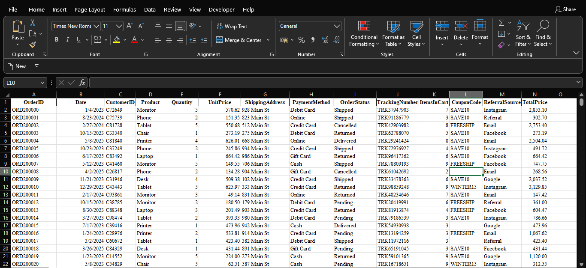
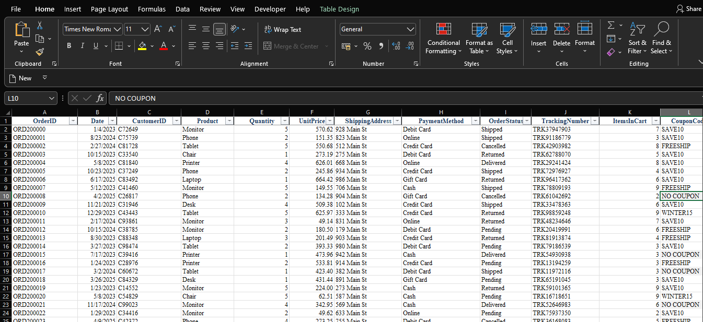

# E-Commerce Data Cleaning Project

## Project Overview

This project focused on identifying and resolving data quality issues within an e-commerce sales dataset to ensure data accuracy, consistency, and reliability for future business analysis.

---

## Dataset Information

* Industry: Retail / E-Commerce
* Records: 1,200
* Tool Used: Microsoft Excel & Power Query

---

## Data Quality Assessment

The dataset was assessed for:

* Missing Values
* Duplicate Records
* Data Consistency
* Structural Issues

### Findings

| Check             | Result                                |
| ----------------- | ------------------------------------- |
| Missing Values    | 309 blanks found in CouponCode column |
| Duplicate Records | 0 duplicates found                    |
| Date Issues       | None detected                         |
| Structural Issues | None detected                         |

---

## Before Cleaning

Insert Screenshot Here



The CouponCode column contained 309 blank records that could affect promotional campaign analysis.

---

## Data Cleaning Actions

### Missing Value Treatment

* Identified 309 blank records in CouponCode.
* Replaced blank values with:

```text
NO COUPON
```

This preserved all transaction records while correctly identifying customers who completed purchases without using a promotional code.

### Duplicate Validation

* Checked for duplicate records.
* No duplicate records were found.
* No rows were removed.

---

## After Cleaning

Insert Screenshot Here



All missing CouponCode values were standardized as "NO COUPON", improving data consistency and analysis readiness.

---

## Project Outcome

The cleaned dataset is now ready for:

* Exploratory Data Analysis (EDA)
* Customer Purchase Analysis
* Product Performance Analysis
* Revenue Analysis
* Marketing Campaign Analysis

---

## Files Included

* E-Commerce_Data_Cleaning.xlsx
* E-Commerce Data Cleaning Report.pdf
* Before_Cleaning.png
* After_Cleaning.png

---

### Author

Favour Oladapo

Data Analytics Intern
